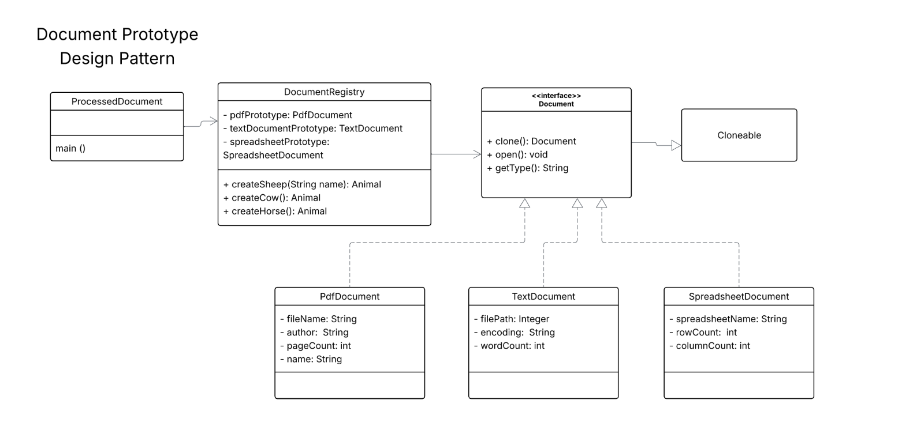

# Document-Registry-Prototype-Design

## Overview
This project simulates a Document Registry system that uses the Prototype Pattern to create and manage documents. Instead of creating new instances of each document type from scratch, a set of prototype documents is used to clone and customize new instances, improving efficiency and simplifying document management.

## Document Types Supported:
    - PDF Documents
    - Text Documents
    - Spreadsheet Documents

## Design Pattern
The Prototype Design Pattern is used in this project. It allows an object to be copied or cloned without knowing the exact class of the object. Instead of creating new objects, existing objects (prototypes) are cloned and customized to create new instances.

In this example, we have a DocumentRegistry class that holds prototypes for PdfDocument, TextDocument, and SpreadsheetDocument. New documents can be created by cloning these prototypes and modifying their attributes, such as file name, author, word count, etc.

##Classes
    - **`Document` Interface (`Cloneable`)**
    This is the common interface for all document types. It defines methods to:
        - clone(): To create a new clone of the document.
        - open(): To open and display document details.
        - getType(): To get the document type.

    - **PdfDocument**
    A concrete class that implements Document, representing a PDF document with:
        - File name
        - Author
        - Page count
        - Name of the document

    - **TextDocument**
    A concrete class that implements Document, representing a text document with:
        - File path
        - Encoding type
        - Word count

    - **SpreadsheetDocument**
    A concrete class that implements Document, representing a spreadsheet document with:
        - Speadsheet name
        - Row count
        - Column count

    - **DocumentRegistry**
    This class manages the prototypes for each document type (PdfDocument, TextDocument, and SpreadsheetDocument). It allows clients to:
        - Create document prototypes.
        - Clone prototypes and create custom documents.

    - **`ProcessedDocument` Test Class**
    The main driver class. It demonstrates how the DocumentRegistry class is used to create document prototypes, clone them, and open and display their details.

UML Class Diagram of Document Registry (Prototype Design):
